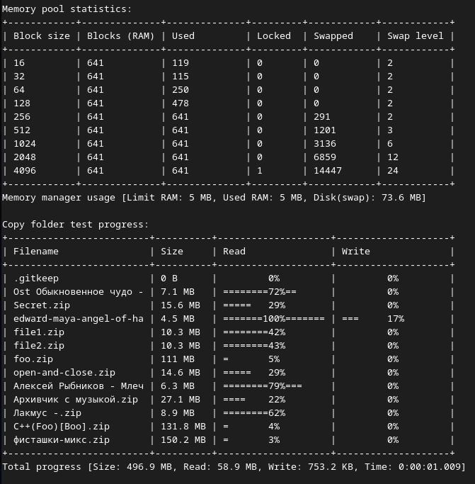

# Менеджер памяти со свопом.

## Cодержание

1. [Краткая постановка задачи](#short-task)
2. [Сборка программы](#build-program)
3. [Запуск программы](#run-program)
4. [Проверка результатов работы (тесты)](#tests)
5. [Интересные идеи](#ideas) 
6. [Проблемы данной реализации](#problems)
7. [Формальная постановка задачи](./TASK.md)


## Краткая постановка задачи <a name="short-task"></a>

Cоздать менеджер памяти, позволяющий 

- выделять блоки из оперативной памяти в пределах заданного лимита
- автоматически перемещать неиспользуемые в данный момент блоки на диск (своп) в случае нехватки оперативной памяти 
- загружать блоки с диска обратно в оперативную память при необходимости доступа к ним

Это может пригодиться при обработке больших объемов данных, которые не помещаются целиком в оперативную память. Я никогда не работал с менеджерами памяти - это первый опыт. Поэтому это не прикладной, а учебный и экспериментальный проект. А вообще это тестовое задание для трудоустройства. Полное и более детальное описание смотрите в разделе ["Формальная постановка задачи"](./TASK.md)

Для проверки работы менеджера памяти его предлагается "загрузить" копируя большие файлы (~2Гб каждый) из одной папки в другую. При этом надо каждый файл сперва загрузить в менеджер памяти _целиком_ (читая блоками случайных размеров), а затем выгрузить эти данные из менеджера памяти в выходной файл. Дополнительно требуется, чтобы менеджер памяти был многопоточным, поэтому копирование каждого файла должно выполняться в отдельном потоке.  

Процесс работы теста выглядит примерно так


Cверху статистика по пулам памяти менеджера памяти, а внизу таблица с прогрессом копирования каждого файла. На скриншоте копируются маленькие
файлы просто для примера. Полные логи копирования гигабайтных файлов есть в папке [logs](./logs).

## Сборка программы <a name="build-program"></a>

Для сборки я использовал CMake. Собирать надо из папки build.
```
cd build
cmake ..
make
```
Я собирал и тестировал код на двух платформах:

- g++ с поддержкой C++17 для сборки под linux 
- Visual Studio 2020 (C++17) под windows 10.

## Запуск программы <a name="run-program"></a>

После сборки в директории build/source/ появится исполняемый файл memory_manager_test. Эта программа - "тест", в котором выполняется копирование файлов из директории 'input' в папку 'output', используя менеджер памяти. 

В качестве аргумента командной строки она получает размер доступной менеджеру памяти оперативной памяти в мегабайтах. Если мы хотим разрешить менеджеру управлять 10 Мб, то запустим с параметром 10:

```
./build/source/memory_manager_test 10
```

При этом это ограничение действует только на объем памяти напрямую выделяемый менеджером с помощью malloc. Дополнительно в процессе работы менеджер создает разные объекты и списки содержающие служебную информацию о выделенных блоках (адрес, размер и т.п.). В данной реализации на эти данные ограничение не действует. При этом дополнительно задействуется порядка 40 байт на каждый блок. Это вполне допустимые накладные расходы с учетом того, что в среднем длина блока 512 байт (~8%).

В данной реализации максимальный размер свопа косвенно связан с размером используемой оперативки, а именно размер свопа можем быть до 100 раз больше, чем указанный лимит оперативной памяти. То есть если вы хотите работать с виртуальными 10Гб, то необходимо разрешить менеджеру памяти использовать хотя бы 100 Мб реальной RAM. 

Это ограничение не сложно убрать, но пока оно есть.

## Проверка результатов работы (тесты) <a name="tests"></a>

Для проверки правильности работы я написал пару bash скриптов:
- check_result.sh - сравнивает файлы во входной и выходной директории и выводит [Ok] или [Erorr] для каждого файла. Использует утилиту diff для сравнения, пропускает вложенные папки (их не надо копировать).
- run_tests.sh - запускает memory_manager_test и check_result.sh многократно повторяя этот тест. Количество повторов задается аргументом командной строки (по-умолчанию 1 раз). Мне это было нужно, чтобы проверять корректность работы в многопоточном режиме - одного или двух тестов в таком случае не достаточно.

Скрипт run_tests.sh сам определяет общий объем файлов в копируемой папке и в качестве лимита используемой оперативной памяти задает 5% от этого объема. А вывод каждого теста записывается в отдельный лог в папке log_tests. Для запуска можно просто набрать команду
```
./run_tests.sh
```

## Интересные идеи <a name="ideas"></a>

Если менеджер памяти будет отдавать блоки в виде простых указателей (адресов), то он никак не сможет контролировать использование этих блоков. 

В таком случае пользователь менеджера должен будет каким-то образом сообщать менеджеру какие блоки не используются в данный момент, чтобы их можно было выгрузить на диск. 

И наоборот - прежде чем обратиться к блоку памяти необходимо будет вызвать функцию, которая выгрузить блок из свопа в оперативную память (в тоже самое место, где он был выделен!). Последнее не всегда возможно, особенно при многопоточном режиме работы менеджера памяти, так как нужные адреса могут быть уже заняты другими блоками, которые также используются в данный момент. 

Кроме того, пользователи менеджера запросто могут забыть вызвать функцию загрузки блока в ram, а также отмечать блоки неиспользуемыми, что приведет к неопределенному поведению или взаимным блокировкам потоков.

И, еще, хотелось бы иметь возможность узнать размер каждого полученного блока в любой момент времени. Сырые указатели не позволяют этого сделать.

В языке С++ нет встроенной возможности контроля доступа к памяти (user mode), но можно хотя бы попытаться обезопасить работу добавив автоматические локи и анлоки блоков. Для этого менеджер памяти должен возвращать обертку над указателем, которая предоставит более безопасный интерфейс. В моей реализации менеджер памяти возвращает объекты класса MemoryBlock. В них есть все нужные методы блокировки и разблокировки блока, получения его используемого размера и емкости (реального размера выделенного блока).
```
- size_t size() const;
- size_t capacity() const;
- void lock();
- void unlock();
- void free();
- bool isLocked() const;
```

Для получения сырого указателя на данные есть шаблонный метод 
```
data<typename T=char>()
```
который приводит этот указатель к указателю на тип T (по умолчанию char). Например, при записи блоков в файл он используется так: 
```
file.write( block.data(), block.size() );
```
Такой вариант показался мне самым удобным.

Кроме того, вызов метода data() создает автолокер - временный объект, который залочит блок перед входом в функцию write и также разлочит его после ее завершения. 

Таким образом, если не использовать методы lock() и unlock() напрямую и выполнять все операции с блоками внутри функции, то это будет работать автоматически и более надежно. 

Но, напрактике, скорее всего, программисты будут смешивать ручные блокировки и автоматические. Поэтому я реализовал автолокер так, чтобы если блок был залочен до вызова функции, то он не будет залочен повторно и не будет разлочен после выхода из нее. 

То есть, состояние блока (залочен или нет) до и после вызова функции остается неизменным. Это позволит уменьшить вероятность ошибок программистов, использующих эти блоки. В коде теста (копирование файлов) я не использовал прямой вызов методов lock() и unlock(), а полагался на автолокер. Например, функция чтения файла содержит такой код:
```
        // Allocating memory
        MemoryBlock block = memoryManager.getBlock(size);
        fin.read(block.data(), size);
```
А функция записи блока в файл такой:
```
    for (const auto &block : blocks) {
        fout.write(block.data(), block.size());
    }
```
В процессе копирования можно видеть, что в каждый момент времени залочено всего несколько блоков, как и должно быть и это работает автоматически.

Автолокер по сути - это временный объект, который создается при вызове метода data() и имеет операцию приведения к указателю (адресу блока). Этот временный объект лочит блок в конструкторе, сущесвует до окончания вызванной функции и разлочит блок в деструкторе. 


## Проблемы данной реализации <a name="problems"></a>

1. Для хранения информации о выгруженных на диск блоках я использовал таблицу следующего вида

```
swapTable
+--------+-----------------------+
|        |    Blocks indexes     |
| Swap   +---+---+---+-----+-----+
| Level  | 0 | 1 | 2 | ... | N-1 |
+--------+---+---+---+-----+-----+
| 0      | 1 | 1 | 3 |  .  | 2   |
+--------+---+---+---+-----+-----+
| 1      | 2 | 0 | 0 |  .  | 1   |
+--------+---+---+---+-----+-----+
| 2      | 3 | 0 | 0 |  .  | 0   |
+--------+---+---+---+-----+-----+
| 3      | 0 | 0 | 2 |     | 0   |
+--------+---+---+---+-----+-----+
```

Она ставит в соответсвие каждому уровню свопа (строка) и индексу блока в RAM целое число - идентификатор
выгруженного блока (swapId). Уровень 0 соответсвует RAM, остальные уровни - файлам. 

Эта реализация имеет ряд недостатков:

- Логичнее было бы хранить в таблице уровни свопа, которые соответствуют идентификаторам блоков. В таком
случае при поиске блока по его swapId не нужно было бы пробегаться по столбцу таблицы. Так будет эффективнее, но
я думаю это не сильно повляет на производительность так как поиск в массиве из ~100 элементов выполняется гораздо
быстрее чем считывание блоков из файлов (а нужен он только вместе со считыванием).

- Каждый уровень свопа записывается в отдельный файл. Но во всех ОС есть ограничение на количество открытых 
программой файлов (обычно 1024), поэтому такая реализация не позволяет использовать более 100 уровней свопа в одной директории.
Именно поэтому размер виртуальной памяти (со свопом) не превышает 100 размеров реально используемой оперативной памяти. Следующее ограничение на объем свопа накладывает тип данных идентификатора свопа
```
using SwapIdType = uint8_t;
constexpr SwapIdType MAX_SWAP_LEVEL = std::numeric_limits<SwapIdType>::max();
```

Сейчас он имеет тип uint8_t, а значит не более 254 уникальных идентификаторов, кроме 0 (пусто) и 1 - ram. Убрать это ограничение можно просто расширив тип до uint16_t.

2. Вторая и более существенная проблема.

Задача копирования файлов не требует одновременной работы в одном потоке сразу с несколькими блоками, 
однако в других задачах такая необхомость скорее всего будет, например, хотелось бы использовать memncpy()
для копирования данных из одного блока в другой. В данной реализации если 2 блока окажутся в таблице в одном
столбце (память под них будет выделена в одном реальном блоке RAM), то только один из них сможет находиться
на нулевом уровне (в оперативной памяти). 
Этот недостаток можно исправить переносом блока в другой блок оперативной памяти, но я пока этого не сделал.
